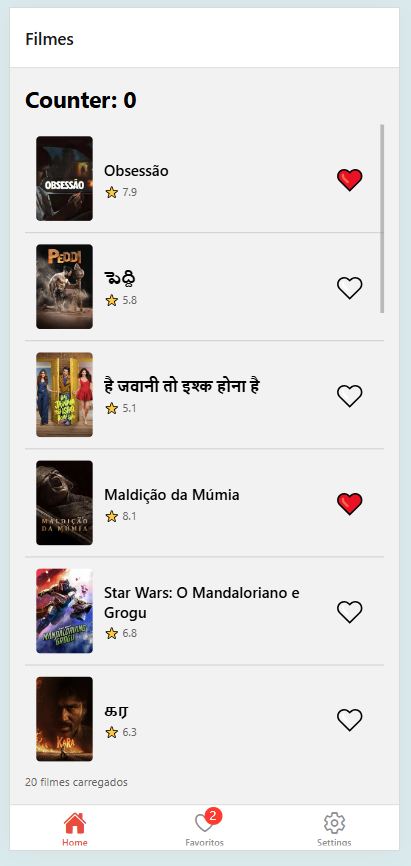
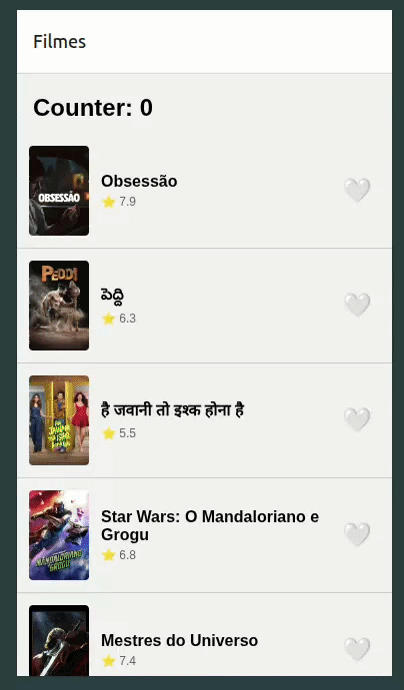

# README — Atividade 2 — [Seu Nome]

> Use isso como base do README.md do seu projeto.

## Identificação

- **Aluno:** Matheus Mestre Picerne
- **Opção Reanimated escolhida:** A heart pop
- **Bonus implementado:** Bottom Tabs e TanStack Query staleTime + prefetch
- **Repo (seu fork):** https://github.com/matheusmestre/puc-iec-mobile-multiplataforma

## Como rodar

```bash
npm install
npx expo start
```

> ⚠️ MMKV não roda em web. Use simulador iOS (`i`) ou Android (`a`).

## O que o app faz

- Exibe uma lista de filmes populares da API TMDB com busca e detalhes por título. 
- Permite marcar e desmarcar favoritos com persistência local via MMKV e animação de coração (Reanimated). 
- Organizado com navegação em abas (Bottom Tabs), gerenciamento de estado via Zustand e cache de dados com TanStack Query.

## Screenshot



## Screencast da animação



> Substitua pelas mídias reais. GIF deve ter 15-30s mostrando a animação acontecendo.

## Arquitetura

```
src/
├── navigation/
│   └── RootStack.tsx
├── screens/
│   ├── MovieList.tsx
│   └── MovieDetail.tsx
├── components/
│   ├── MovieCard.tsx
│   └── HeartButton.tsx       ← animação Reanimated
├── store/
│   ├── counterStore.ts
│   └── favoritesStore.ts     ← Zustand + persist + MMKV
├── api/
│   └── useMovies.ts          ← TanStack Query
└── storage/
    └── mmkv.ts
```

## Decisões técnicas (3-5 linhas)

- O principal motivo pela escolha do Reanimated A foi a simplicidade tanto da solução quanto da implementação. 
- MMKV opera de forma síncrona via JSI, eliminando a ponte assíncrona do React Native. Isso torna leituras e escritas instantâneas, sem await, ideal para persistência de estado frequente como favoritos.

## Referência

React Native Reanimated — https://docs.swmansion.com/react-native-reanimated/
react-native-mmkv — https://github.com/mrousavy/react-native-mmkv
Zustand — https://zustand.docs.pmnd.rs/
TanStack Query — https://tanstack.com/query/latest/docs/framework/react/overview

---

## 🎁 Bonus implementado (opcional)

- [X] **Bottom Tabs com aba Favoritos filtrada — +2pt**
- [ ] Deep link `expo://detail/<id>` — +1pt
- [ ] 2 das 3 opções Reanimated (A/B/C) — +1pt
- [X] TanStack Query `staleTime` + `prefetchQuery` — +1pt
- [ ] Hermes habilitado (verificar `app.json`) — +0.5pt
- [ ] CI GitHub Actions verde — +0.5pt