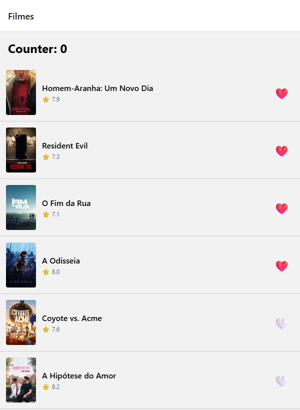

# Atividade 2 — App de Filmes: Favoritos + MMKV + Reanimated

## Identificação

- **Aluno:** Allainn Christiam Jacinto Tavares
- **Opção Reanimated escolhida:** A — heart pop (escala 1 → 1.4 → 1 com mola + rotação leve)
- **Bonus implementado:** paginação infinita na lista de filmes (`useInfiniteQuery` + `onEndReached`)
- **Repo (fork):** https://github.com/Allainn/puc-iec-mobile-multiplataforma/tree/entrega/atividade-2-allainn-tavares/exercicios/02-app-rn-navegacao-estado/allainn-tavares

## Como rodar

```bash
cd exercicios/02-app-rn-navegacao-estado/allainn-tavares
npm install
cp .env.example .env    # colar o API Read Access Token (v4) do TMDB em EXPO_PUBLIC_TMDB_TOKEN
npx expo start --web    # abre em http://localhost:8081
npm test                # 21 testes Jest
```

> Desenvolvido e testado na **web**: lá a persistência usa `localStorage` pela mesma interface do MMKV (`src/storage/mmkv.ts`). No iOS/Android usa o MMKV de verdade, que exige *development build* (não vem no Expo Go).

## O que o app faz

Lista os filmes populares do TMDB com TanStack Query (dados considerados frescos por 5 min) e abre o detalhe de cada filme. A lista é infinita: ao chegar perto do fim, a próxima página é buscada e anexada, com um spinner no rodapé. O ❤️ favorita e desfavorita pelo store Zustand; os favoritos são salvos de forma síncrona e continuam lá depois de recarregar a página ou reabrir o app. Ao tocar, o coração dá um "pop" animado com Reanimated, na lista e no detalhe.

## Screenshot



## Arquitetura

```
src/
├── services/api.ts               ← axios + token TMDB (v3 ou v4)
├── queries/movies/               ← TanStack Query (server state)
│   ├── get-popular-movies.ts     ← usePopularMovies (TASK 2; useInfiniteQuery no bonus)
│   ├── get-movie-by-id.ts
│   └── search-movies.ts
├── store/                        ← Zustand (client state)
│   ├── counterStore.ts           ← TASK 1
│   └── favoritesStore.ts         ← TASK 5 + persistência (TASK 7)
├── storage/mmkv.ts               ← MMKV no nativo, localStorage na web (TASK 7)
├── routes/RootStack.tsx          ← Native Stack: Home → Detail
├── screens/
│   ├── MovieList.tsx             ← FlatList + MovieCard (TASK 3) + onEndReached (bonus)
│   └── MovieDetail.tsx           ← HeartButton ao lado do título (TASK 8)
├── components/
│   ├── MovieCard.tsx             ← favoritar (TASK 6)
│   ├── HeartButton.tsx           ← animação Reanimated (TASK 8)
│   └── TokenMissingScreen.tsx
├── contexts/ThemeContext.tsx
├── types/movie.ts
└── utils/
    ├── poster-url.ts
    └── movie-pages.ts            ← próxima página + juntar páginas sem repetir (bonus)
__tests__/
├── counterStore.test.ts          ← 5 testes (TASK 4)
├── favoritesStore.test.ts        ← 10 testes, incluindo persistência (TASK 9)
└── moviePages.test.ts            ← 6 testes da paginação (bonus)
```

A regra do starter foi mantida: a tela não conhece axios nem endpoint; só consome os hooks de `queries/` e `store/`.

## Decisões técnicas

- **Opção A (heart pop):** dá feedback no próprio gesto de favoritar usando só `useSharedValue` + `useAnimatedStyle` + `withSequence(withTiming, withSpring)`, sem biblioteca de gestos. A animação roda na UI thread; mudar o shared value não re-renderiza o React.
- **MMKV em vez de AsyncStorage:** a leitura é síncrona (JSI), então o store já nasce com os favoritos (`loadInitial()` no `create`), sem estado de "carregando" nem troca 🤍 → ❤️ depois do primeiro render.
- **Persist manual com `subscribe`** em vez do middleware `persist`: segundo o starter, o middleware do Zustand usa `import.meta.env`, que quebra no bundler web do Metro. Como `add`/`remove` sem efeito devolvem o próprio estado, o store não notifica nem grava à toa.
- **Seletor por filme** (`s.isFavorite(movie.id)`): cada card só re-renderiza quando o favorito dele muda.
- **Trade-off:** na web não existe UI thread separada; lá o Reanimated anima via `requestAnimationFrame` na thread principal.
- **Paginação com `useInfiniteQuery`** em vez de um `useState` de página: o cache guarda todas as páginas numa entrada só (`data.pages`), então voltar do detalhe não perde o scroll nem refaz requests. `getNextPageParam` usa `page`/`total_pages` da resposta e para na página 500, o máximo que o TMDB aceita. A lista junta as páginas removendo ids repetidos, porque o ranking de populares muda enquanto se rola e um filme pode cair em duas páginas (id duplicado quebra a `key` da `FlatList`). Se uma página seguinte falhar, a lista continua na tela e o rodapé oferece "tentar de novo".
- **Trade-off da paginação:** o pull-to-refresh refaz todas as páginas já carregadas, em sequência (é o comportamento do `refetch` em query infinita). Com muitas páginas abertas, isso pesa.

## Testes

21 testes Jest (`npm test`): 5 do counter, 10 de favoritos — toggle, isFavorite, clear, sem duplicata, sem notificação à toa, persistência ao reabrir o app, conteúdo inválido no storage e storage da web (disponível e bloqueado) — e 6 da paginação (próxima página, fim da lista, limite de 500 do TMDB, junção das páginas sem repetir filme). Foram gerados com auxílio de IA (Claude Code) e revisados; para conferir que pegam bug, o código foi quebrado de propósito e os testes certos falharam.

## Referências

- SOFTWARE MANSION. *React Native Reanimated*. Documentação oficial. Disponível em: https://docs.swmansion.com/react-native-reanimated/. Acesso em: 28 set. 2026.
- ROUSAVY, M. *react-native-mmkv*. GitHub. Disponível em: https://github.com/mrousavy/react-native-mmkv. Acesso em: 28 set. 2026.
- PMNDRS. *Zustand*. GitHub. Disponível em: https://github.com/pmndrs/zustand. Acesso em: 28 set. 2026.
- TANSTACK. *TanStack Query*. Documentação oficial. Disponível em: https://tanstack.com/query/latest. Acesso em: 28 set. 2026.
