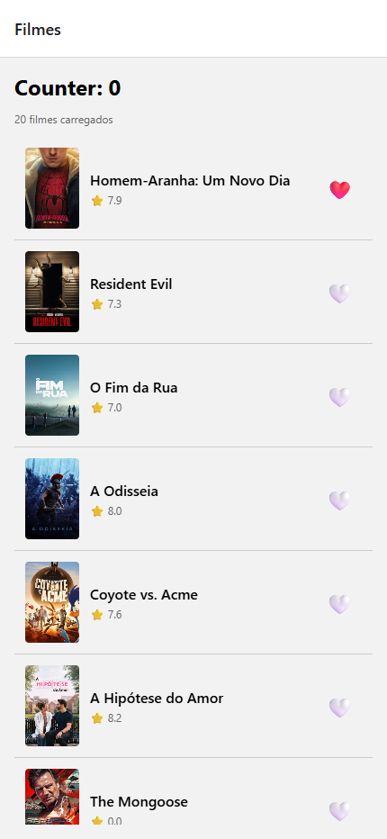
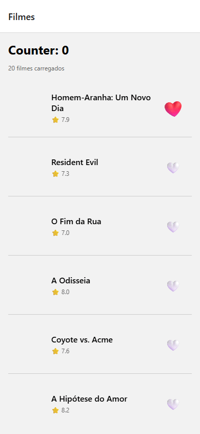

# README — Atividade 2 — Jhonathan Carvo

App Expo + TypeScript com arquitetura profissional separando **services**, **queries**, **contexts**, **screens**, **components**.

> Você vai usar esse starter no **hands-on da Aula 2** (em sala) e na **Atividade 2** (entrega 10/06, 15pts).

---

## Arquitetura

```
src/
├── services/           ← HTTP (axios + interceptors)
│   └── api.ts
├── queries/            ← TanStack Query (server state)
│   └── movies/
│       ├── get-popular-movies.ts
│       ├── get-movie-by-id.ts
│       └── search-movies.ts
├── contexts/           ← Estado global APP (theme, auth)
│   └── ThemeContext.tsx
├── store/              ← Zustand (client state local)
│   ├── counterStore.ts
│   └── favoritesStore.ts
├── storage/            ← MMKV persistência
│   └── mmkv.ts
├── routes/             ← Navegação
│   └── RootStack.tsx
├── screens/            ← UI pura
│   ├── MovieList.tsx
│   └── MovieDetail.tsx
├── components/         ← Reutilizáveis
│   ├── MovieCard.tsx
│   └── HeartButton.tsx  ← Reanimated: heart pop
├── types/              ← Tipos TS
│   └── movie.ts
└── utils/              ← Helpers
    └── poster-url.ts

__tests__/              ← Jest + RTL
├── counterStore.test.ts
└── favoritesStore.test.ts

.github/workflows/
└── test.yml            ← CI valida ≥ 6 testes verdes
```

**Regra arquitetural:**
- `services/` = "como falar com backend"
- `queries/` = "como gerenciar ciclo de vida dos dados (server state)"
- `contexts/` = "como compartilhar estado global da aplicação (client state)"
- `screens/` = "renderizar estados da UI"

> Screen **não** conhece axios, endpoint, cache, retry. Ela **só consome dados**.

---

## Setup

### 1. Clonar e instalar

```bash
git clone https://github.com/25823900/puc-iec-mobile-multiplataforma.git
cd puc-iec-mobile-multiplataforma/exercicios/02-app-rn-navegacao-estado/aluno-25823900
npm install
```

### 2. Gerar TMDB API token

1. Cria conta em <https://www.themoviedb.org/signup>
2. Settings → **API** → Request API key (Developer, uso pessoal/educacional)
3. Copia o **API Read Access Token** (formato `eyJhbGc...` longo)
4. `cp .env.example .env` e cola o token:

```bash
EXPO_PUBLIC_TMDB_TOKEN=eyJhbGc...seu_token_aqui
```

> ⚠️ `.env` está no `.gitignore`. **Nunca comite tokens.**

### 3. Rodar

```bash
npx expo start         # menu interativo
# OU
npx expo start --ios   # simulador iOS
npx expo start --android  # emulador Android
```

> ⚠️ MMKV usa JSI no iOS/Android. Na web, este starter usa `localStorage` como polyfill; valide a persistência MMKV real em simulador/emulador nativo.

### 4. Rodar testes

```bash
npm test
# ou em watch mode
npm run test:watch
# ou cobertura
npm run test:coverage
```

CI roda automático em todo push pro `main` do seu fork. Mínimo: **6 testes verdes**; o starter atualmente tem 10.

---

## Tasks guiadas

10 tasks sequenciais. Lista completa em [`PASSOS.md`](./PASSOS.md).

```bash
grep -rn "TODO \[TASK" src/ __tests__/
```

| Tag | Hands-on aula | Atividade 2 |
|---|---|---|
| TASK 1 | Zustand counter store | — |
| TASK 2 | TanStack Query | — |
| TASK 3 | FlatList + MovieCard | — |
| TASK 4 | Testes counter (IA) | — |
| TASK 5 | — | Zustand favorites |
| TASK 6 | — | Integrar favorites em MovieCard |
| TASK 7 | — | MMKV persist |
| TASK 8 | — | HeartButton Reanimated |
| TASK 9 | — | Testes favorites (IA) |
| TASK 10 | — | README + screencast + entrega |

---

## Endpoints TMDB usados

```bash
# Filmes populares
curl 'https://api.themoviedb.org/3/movie/popular?language=pt-BR&page=1' \
  -H "Authorization: Bearer $TOKEN"

# Detalhes
curl 'https://api.themoviedb.org/3/movie/603?language=pt-BR' \
  -H "Authorization: Bearer $TOKEN"

# Buscar
curl 'https://api.themoviedb.org/3/search/movie?language=pt-BR&query=matrix' \
  -H "Authorization: Bearer $TOKEN"
```

Service em `src/services/api.ts` encapsula essas chamadas. Queries em `src/queries/movies/` adicionam cache+ciclo de vida via TanStack Query.

---

## Dicas

- **Path alias:** import com `@/` → resolve pra `src/`. Ex: `import { api } from '@/services/api'`.
- **Reanimated:** plugin Babel já configurado (`babel.config.js`). Restart Metro se mudar config.
- **Hermes:** habilitado por padrão no Expo SDK 54+.

---

## Referências

- [Zustand](https://github.com/pmndrs/zustand)
- [TanStack Query](https://tanstack.com/query/latest)
- [React Navigation v7](https://reactnavigation.org/docs/getting-started)
- [React Native MMKV](https://github.com/mrousavy/react-native-mmkv)
- [Reanimated](https://docs.swmansion.com/react-native-reanimated/)
- [TMDB API docs](https://developer.themoviedb.org/reference/intro/getting-started)

## Relatório da Atividade 2

- **Aluno:** Jhonathan Carvo.
- **Repositório do fork:** https://github.com/25823900/puc-iec-mobile-multiplataforma.
- **Opção Reanimated:** A — Heart pop, com escala e rotação usando `useSharedValue`, `useAnimatedStyle`, `withSequence`, `withTiming` e `withSpring`.
- **Funcionalidades:** favoritos com Zustand; persistência síncrona com MMKV no iOS/Android e `localStorage` na web; favoritos acessíveis na lista e no detalhe.
- **Testes:** cobertura de counter e favoritos, incluindo verificação de persistência no adapter.
- **Como rodar:** `npm install` e `npx expo start`; usar simulador/emulador nativo para validar MMKV.
- **Decisão técnica:** persistência manual por `subscribe` torna explícito o salvamento e evita a configuração adicional do middleware; o botão usa Reanimated para executar a animação na UI thread.
- **Referência:** [Reanimated — Shared values](https://docs.swmansion.com/react-native-reanimated/docs/core/useSharedValue/) e [MMKV](https://github.com/mrousavy/react-native-mmkv).

### Evidências

#### Screenshot



#### Screencast (15,5 s)



As duas evidências foram capturadas executando o app Expo Web. Este ambiente não possui emulador Android/iOS; portanto, o fallback web confirma a persistência em `localStorage`, mas a persistência MMKV nativa e a execução da animação na UI thread ainda precisam ser verificadas em simulador ou dispositivo. Consulte também o [enunciado](../enunciado.md), o [guia passo a passo](../guia-passo-a-passo.md) e o [template do relatório](../template-relatorio.md).

### Bônus implementados

- [ ] Bottom Tabs com aba Favoritos
- [ ] Deep link `expo://detail/<id>`
- [ ] Duas opções de animação Reanimated
- [ ] TanStack Query `prefetchQuery` antes do detalhe
- [x] Hermes habilitado
- [ ] CI GitHub Actions verde (ainda não validado no fork)
