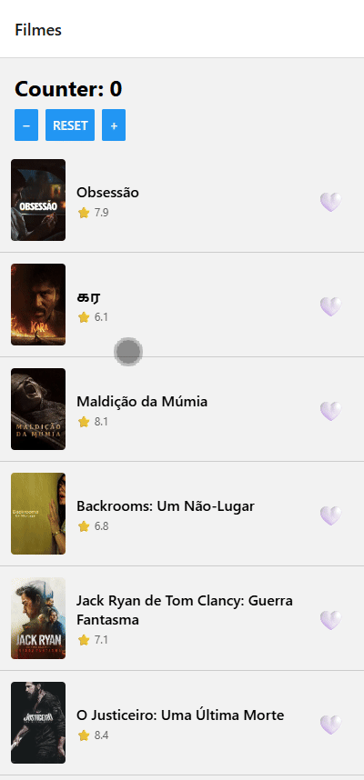
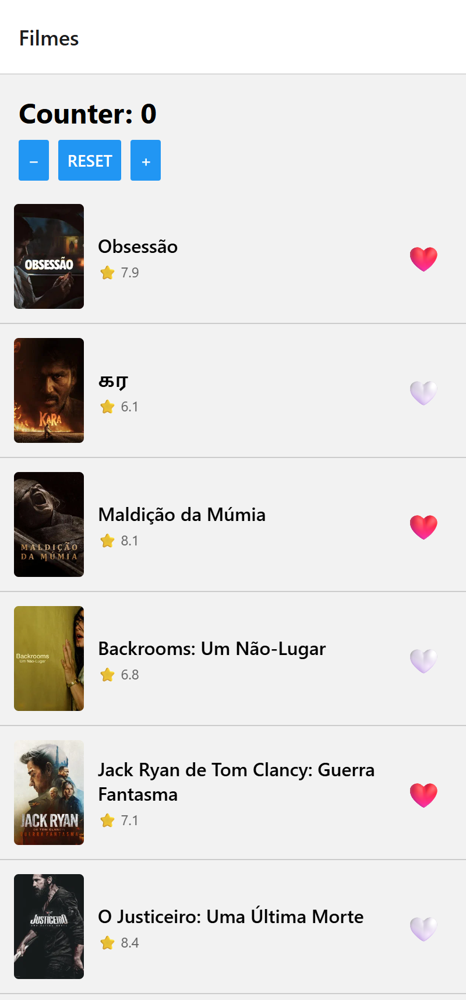

# 🎬 Movie Explorer — Atividade 2

> Disciplina de Desenvolvimento Mobile Multiplataforma
> **Aluno:** Cauã Henrique Viana Salgado
> **GitHub:** CauaHvS

---

## 📋 Informações da Entrega

| Item               | Valor                                                     |
| ------------------ | --------------------------------------------------------- |
| Opção Reanimated   | **A — Heart Pop Animation**                               |
| Bônus Implementado | Não                                                       |
| Repositório        | https://github.com/CauaHvS/puc-iec-mobile-multiplataforma |

---

# 🚀 Visão Geral

Aplicação mobile desenvolvida com **React Native + Expo** para exibição de filmes populares utilizando a API do TMDB.

O projeto demonstra a integração de diversas tecnologias modernas do ecossistema React Native:

* Navegação com React Navigation
* Gerenciamento de estado com Zustand
* Cache e requisições assíncronas com TanStack Query
* Persistência local utilizando MMKV
* Animações nativas com React Native Reanimated

O usuário pode favoritar filmes e manter sua lista salva mesmo após fechar ou reiniciar o aplicativo.

---

# ✨ Funcionalidades

* Listagem de filmes populares
* Tela de detalhes do filme
* Favoritar e desfavoritar filmes
* Persistência local dos favoritos
* Busca de filmes
* Cache automático de requisições
* Animação de coração ao favoritar
* Compatibilidade com Android, iOS e Web (com fallback de armazenamento)

---

# 🎥 Demonstração da Animação

### Heart Pop (Opção A)

Ao tocar no botão de favorito:

1. O coração aumenta de escala (`1 → 1.4`)
2. Retorna suavemente ao tamanho original (`1.4 → 1`)
3. A animação é executada diretamente na UI Thread através do Reanimated

Essa abordagem garante fluidez mesmo quando a JavaScript Thread está ocupada.

### Screencast



> Substitua pelo GIF final demonstrando:
>
> * Favoritar filme
> * Execução da animação
> * Reload do aplicativo
> * Persistência dos favoritos

---

# 📸 Screenshot



> Substitua pela captura de tela final do aplicativo.

---

# ⚙️ Como Executar

## 1. Instalar dependências

```bash
npm install
```

## 2. Configurar variáveis de ambiente

```bash
cp .env.example .env
```

Adicione o seu **TMDB Read Access Token** ao arquivo `.env`.

## 3. Executar o projeto

```bash
npx expo start
```

### Plataformas

```bash
i
```

Executa no simulador iOS.

```bash
a
```

Executa no emulador Android.

```bash
npx expo start --web
```

Executa no navegador.

> ⚠️ O MMKV não funciona na Web por depender de JSI. Para o ambiente web foi implementado um fallback utilizando `localStorage`.

---

# 🏗️ Arquitetura do Projeto

```text
src/
├── routes/
│   └── RootStack.tsx

├── screens/
│   ├── MovieList.tsx
│   └── MovieDetail.tsx

├── components/
│   ├── MovieCard.tsx
│   ├── HeartButton.tsx
│   └── TokenMissingScreen.tsx

├── store/
│   ├── counterStore.ts
│   └── favoritesStore.ts

├── queries/movies/
│   ├── get-popular-movies.ts
│   ├── get-movie-by-id.ts
│   └── search-movies.ts

├── services/
│   └── api.ts

├── storage/
│   └── mmkv.ts

├── contexts/
│   └── ThemeContext.tsx

└── types/
    └── movie.ts
```

---

# 🛠️ Tecnologias Utilizadas

* React Native
* Expo
* TypeScript
* React Navigation
* Zustand
* TanStack Query
* Axios
* React Native MMKV
* React Native Reanimated
* Jest
* GitHub Actions

---

# 📌 Decisões Técnicas

## React Native Reanimated

Foi escolhida a **Opção A (Heart Pop)** por demonstrar claramente o funcionamento de animações executadas na UI Thread.

Implementação baseada em:

* `useSharedValue`
* `useAnimatedStyle`
* `withSpring`

Não foi necessário utilizar `runOnJS`, mantendo toda a animação no ambiente nativo.

---

## Persistência com MMKV

O armazenamento dos favoritos utiliza **MMKV**, uma solução de persistência extremamente rápida para React Native.

Benefícios:

* API síncrona
* Melhor desempenho que AsyncStorage
* Integração simples com Zustand

---

## Subscribe Manual do Zustand

Foi utilizado `store.subscribe()` para persistência dos favoritos em vez do middleware `persist`.

Motivação:

* Evitar incompatibilidades relacionadas ao `import.meta.env` no Metro Bundler
* Tornar explícito o momento em que os dados são gravados em disco
* Melhor valor didático para compreensão do fluxo de persistência

---

## Fallback Web

Para permitir execução em navegadores, foi criado um adaptador de armazenamento que:

* Usa MMKV em Android/iOS
* Usa localStorage na Web

Essa estratégia mantém a mesma API de armazenamento em todas as plataformas.

---

# 🧪 Testes

Executar:

```bash
npm test
```

Cobertura atual:

| Módulo         | Testes |
| -------------- | ------ |
| counterStore   | 5      |
| favoritesStore | 7      |
| Total          | 12     |

Todos os testes encontram-se passando.

---

# 🔄 Integração Contínua

O projeto possui pipeline de CI configurado com GitHub Actions.

Arquivo:

```text
.github/workflows/test.yml
```

A pipeline executa automaticamente os testes a cada push e pull request.

---

# 📚 Referências

1. Mrousavy. *react-native-mmkv — Extremely Fast Key/Value Storage for React Native*. GitHub. https://github.com/mrousavy/react-native-mmkv

2. Software Mansion. *React Native Reanimated Documentation*. https://docs.swmansion.com/react-native-reanimated

3. TMDB API Documentation. https://developer.themoviedb.org

---

# ✅ Requisitos Atendidos

* [x] Consumo da API TMDB
* [x] Navegação entre telas
* [x] Gerenciamento de estado com Zustand
* [x] Persistência local com MMKV
* [x] Cache com TanStack Query
* [x] Animação Reanimated (Opção A)
* [x] Testes automatizados
* [x] Pipeline CI configurada
* [x] README documentado
