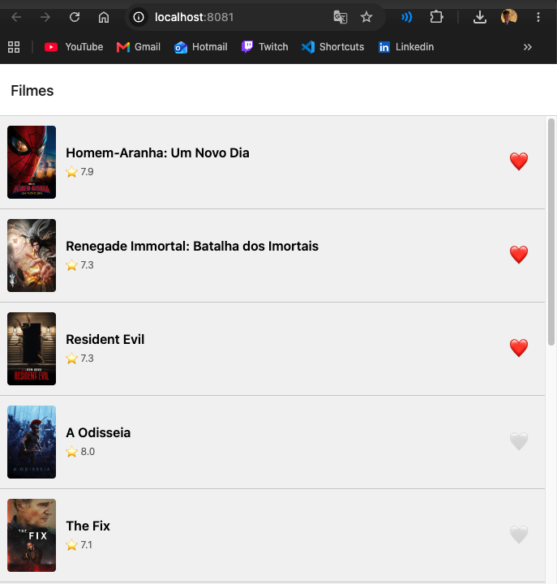
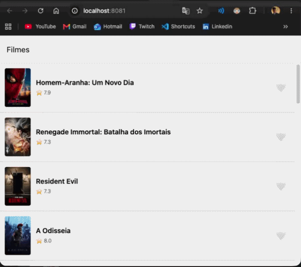

# Atividade 2 — App de Filmes: Favoritos + MMKV + Reanimated

## Identificação

- **Aluno:** João Vítor Vieira Martins
- **Matrícula:** 258850
- **Opção Reanimated escolhida:** A — Heart pop
- **Repo (fork):** https://github.com/joaovito9/puc-iec-mobile-multiplataforma

## Como rodar

```bash
npm install
cp .env.example .env   # colar o token da API do TMDB no .env
npx expo start --web   # ou npx expo start e escolher i (iOS) / a (Android)
```

Rodar os testes:

```bash
npm test
```

## O que o app faz

O app lista os filmes populares do TMDB (TanStack Query) e permite favoritar
qualquer filme pelo ❤️, tanto na lista quanto na tela de detalhes. Os favoritos
ficam num store global (Zustand) e são salvos no armazenamento local, então
sobrevivem ao recarregar o app. Ao tocar no coração, ele faz uma animação de
"pop" com Reanimated, rodando na UI thread.

## Screenshot



## Screencast da animação



## Arquitetura

```
src/
├── routes/
│   └── RootStack.tsx          ← navegação (Stack: lista → detalhe)
├── screens/
│   ├── MovieList.tsx          ← FlatList de filmes
│   └── MovieDetail.tsx        ← detalhe + HeartButton
├── components/
│   ├── MovieCard.tsx          ← card do filme + HeartButton
│   └── HeartButton.tsx        ← animação Reanimated (opção A)
├── store/
│   ├── counterStore.ts        ← Zustand (exercício de sala)
│   └── favoritesStore.ts      ← Zustand + persistência via subscribe
├── storage/
│   └── mmkv.ts                ← MMKV no nativo / localStorage na web
├── queries/movies/            ← TanStack Query (filmes populares, detalhe)
└── services/
    └── api.ts                 ← cliente HTTP do TMDB (axios)

__tests__/
├── counterStore.test.ts       ← 4 testes
└── favoritesStore.test.ts     ← 6 testes
```

## Decisões técnicas

- **Reanimated opção A (heart pop):** escala com `withSequence(withTiming(1.4), withSpring(1))`
  e uma rotação leve em paralelo, usando `useSharedValue` + `useAnimatedStyle`. A animação roda
  na UI thread, sem re-render do React. O `HeartButton` é um componente separado e não conhece o
  store (recebe `active` e `onPress`), por isso foi reaproveitado na lista e no detalhe.
- **MMKV em vez de AsyncStorage:** o MMKV é síncrono (via JSI), então os favoritos são lidos
  já na criação do store, sem estado de "carregando". Na web, onde o MMKV não existe, o adaptador
  `mmkvStorage` usa o `localStorage` com a mesma interface.
- **Persistência via `subscribe`** em vez do middleware `persist`, seguindo o starter: fica
  explícito quando o salvamento acontece e evita o problema do middleware no bundler web.
- **Store imutável:** `add`/`remove` sempre criam um novo array (spread/filter), para o React
  detectar a mudança. O `add` ignora IDs já favoritados, para não haver duplicatas.
- **`tsconfig.json`:** adicionados `paths` (alias `@/` → `src/`, já usado pelo Babel) e
  `types: ["jest"]`, para o editor reconhecer os imports e os testes. Não altera a execução.

## Referências

- Reanimated — documentação oficial: https://docs.swmansion.com/react-native-reanimated/
- react-native-mmkv: https://github.com/mrousavy/react-native-mmkv
