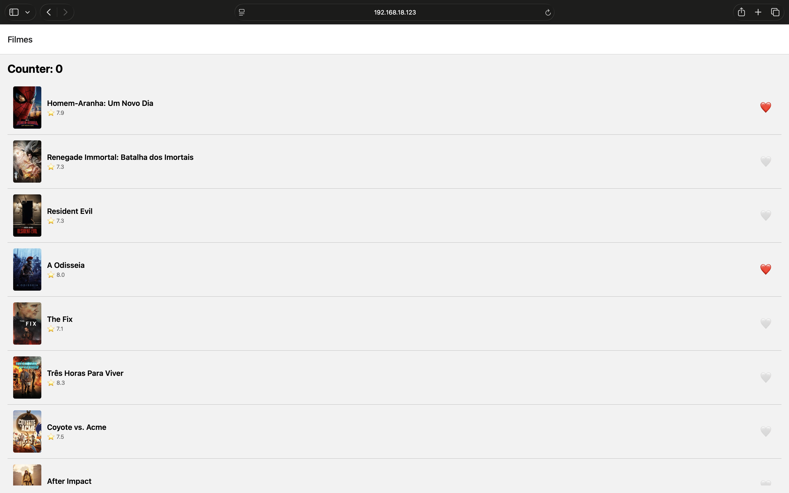

# Atividade 2 — App RN: Favoritos + MMKV + Reanimated

## Identificação

- **Aluno:** Paulo Henrique Nunes Vanderley (GitHub: paulnune)
- **Opção Reanimated escolhida:** A — Heart pop
- **Bônus implementado:** nenhum
- **Repo (seu fork):** https://github.com/paulnune/puc-iec-mobile-multiplataforma

## Como rodar

```bash
npm install
cp .env.example .env   # colar o TMDB API Read Access Token em EXPO_PUBLIC_TMDB_TOKEN
npx expo start
```

> ⚠️ MMKV não roda em web. Use simulador iOS (`i`) ou Android (`a`).

## O que o app faz

Lista filmes populares da TMDB (TanStack Query, com cache de 5 min). Cada filme tem um ❤️ que favorita ou desfavorita via store Zustand. Os favoritos são salvos no MMKV e continuam após reiniciar o app. O coração anima com um pop (escala 1 → 1.4 → 1) usando Reanimated, com worklets na UI thread.

## Screenshot



## Screencast da animação


## Arquitetura

```
src/
├── components/
│   ├── MovieCard.tsx
│   └── HeartButton.tsx       ← animação Reanimated (opção A)
├── queries/movies/
│   └── get-popular-movies.ts ← TanStack Query
├── screens/
│   ├── MovieList.tsx
│   └── MovieDetail.tsx
├── store/
│   ├── counterStore.ts
│   └── favoritesStore.ts     ← Zustand + persistência manual em MMKV
└── storage/
    └── mmkv.ts               ← MMKV nativo, com fallback localStorage na web
__tests__/
├── counterStore.test.ts      ← 4 testes
└── favoritesStore.test.ts    ← 4 testes (MMKV mockado)
```

## Decisões técnicas

- **Reanimated opção A (heart pop):** é a animação mais simples que ainda exige o que o enunciado pede: `useSharedValue` + `useAnimatedStyle` + `withSpring`, rodando na UI thread. A opção B (swipe) e a C (shared element) envolvem gestos e navegação, o que ficou fora do escopo desta entrega.
- **MMKV em vez de AsyncStorage:** é síncrono e roda via JSI, sem bridge assíncrona. Para uma lista de ids que é lida na inicialização, isso evita tela piscando.
- **Persistência manual com `subscribe` em vez do middleware `persist`:** segue a orientação do starter. O `persist` não foi usado para evitar problemas no bundler web com `import.meta`, e o `subscribe` deixa explícito quando a escrita acontece.

## Referência

- Reanimated — documentação oficial, *Animations / withSpring*: https://docs.swmansion.com/react-native-reanimated/
- MMKV — https://github.com/mrousavy/react-native-mmkv
