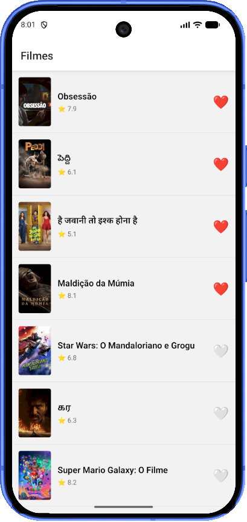

# README — Atividade 2 — Thalysson Henrique

## Identificação

- **Aluno:** Thalysson Henrique
- **Opção Reanimated escolhida:** A heart pop
- **Repo (seu fork):** https://github.com/thsl97/puc-iec-mobile-multiplataforma

## Como rodar

```bash
npm install
npx expo start
```

> ⚠️ MMKV não roda em web. Use simulador iOS (`i`) ou Android (`a`).

## O que o app faz

App mobile em React Native que lista filmes populares, com dados da API [The Movie Database (TMDB)](https://www.themoviedb.org/?language=pt-BR)
O app lista filmes populares, sinopse, nota da crítica e permite que o usuário favorite filmes.

## Screenshot



## Screencast da animação


## Arquitetura

```
src/
├── navigation/
│   └── RootStack.tsx
├── screens/
│   ├── MovieList.tsx
│   └── MovieDetail.tsx
├── components/
│   ├── MovieCard.tsx
│   └── HeartButton.tsx       ← animação Reanimated
├── store/
│   ├── counterStore.ts
│   └── favoritesStore.ts     ← Zustand + persist + MMKV
├── api/
│   └── useMovies.ts          ← TanStack Query
└── storage/
    └── mmkv.ts
```

## Decisões técnicas

### React Native Reanimated

Foi escolhida a opção **A - Heart Pop** para demonstrar o funcionamento de animações que executam na thread UI nativamente

### MMKV

MMKV foi escolhido para armazenamento dos favoritos por ser uma das opções mais rápidas de persistência para apps React Native

## Referência

1. [The Movie Database (TMDB)](https://developer.themoviedb.org/docs/getting-started)
2. [MMKV docs](https://github.com/mrousavy/react-native-mmkv)
