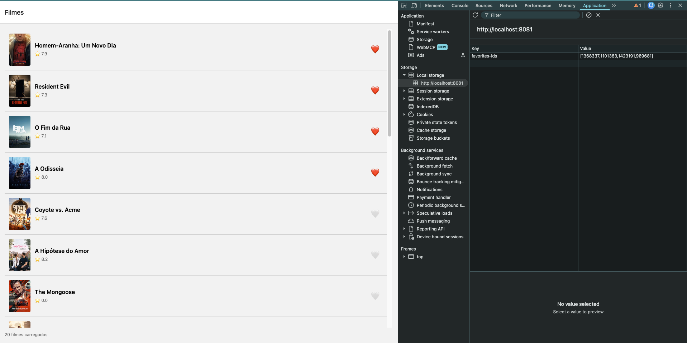
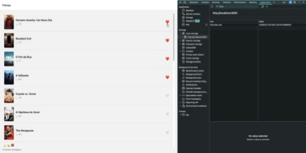

# README — Atividade 2 — Amir Gabriel Dantas Santos Andrade

## Identificação

- **Aluno:** Amir Gabriel Dantas Santos Andrade
- **Opção Reanimated escolhida:** A — heart pop
- **Bonus implementado:** Bottom Tabs com aba Favoritos, deep link, TanStack Query `staleTime` + `prefetchQuery`, Hermes
- **Repo (seu fork):** <https://github.com/roymas100/puc-iec-mobile-multiplataforma>

## Como rodar

```bash
cd exercicios/02-app-rn-navegacao-estado/starter
npm install
npx expo start
```

> ⚠️ MMKV não roda em web (o app cai num fallback com `localStorage`). Use simulador iOS (`i`) ou Android (`a`).

Testes:

```bash
npx jest
```

## O que o app faz

Lista os filmes populares da TMDB (TanStack Query) e permite favoritar cada filme com um botão de coração animado (Reanimated). Os favoritos ficam em um store Zustand e são persistidos no MMKV, sobrevivendo a reloads. O app tem três abas — Home, Favorites e Settings — e as abas Home e Favorites abrem o detalhe do filme em stacks próprios.

## Screenshot



> Rodando na web: à direita, o DevTools mostra a chave `favorites-ids` persistida (na web o `mmkv.ts` usa `localStorage`; no nativo, MMKV).

## Screencast da animação



## Arquitetura

```
src/
├── routes/
│   ├── RootNavigation.tsx       ← Bottom Tabs (Home / Favorites / Settings)
│   ├── RootStack.tsx            ← stack da Home (MovieList → MovieDetail)
│   └── FavoriteStack.tsx        ← stack de Favoritos (FavoriteMovieList → MovieDetail)
├── screens/
│   ├── MovieList.tsx
│   ├── FavoriteMovieList.tsx
│   └── MovieDetail.tsx
├── components/
│   ├── MovieCard.tsx            ← favoritar + prefetch do detalhe
│   ├── HeartButton.tsx          ← animação Reanimated
│   └── TokenMissingScreen.tsx
├── store/
│   ├── counterStore.ts
│   └── favoritesStore.ts        ← Zustand + persist manual (subscribe) + MMKV
├── queries/movies/              ← TanStack Query
│   ├── get-popular-movies.ts
│   ├── get-movie-by-id.ts       ← useMovieById + prefetchMovieById
│   └── search-movies.ts
├── services/
│   └── api.ts                   ← cliente HTTP da TMDB
├── storage/
│   └── mmkv.ts                  ← MMKV no nativo, localStorage na web
├── contexts/
│   └── ThemeContext.tsx
├── types/
│   └── movie.ts
└── utils/
    └── poster-url.ts
```

## Decisões técnicas

- **Reanimated A (heart pop):** é o feedback mais direto para a ação principal do app (favoritar).
- **Um stack por aba:** Home e Favorites reaproveitam a mesma tela `MovieDetail`, mas cada aba mantém seu próprio histórico de navegação. A tela de lista de Favoritos é separada porque, pelo enunciado, ela deve mostrar a lista filtrada pelo store.
- **Trade-off:** o store guarda só os `ids`. A aba Favoritos filtra os filmes populares já carregados, então um favorito que não está nessa página não aparece. O ideal seria buscar os favoritos pela API, a partir dos `ids`, em vez de filtrar no front.

## Referência

- React Navigation — Deep linking: <https://reactnavigation.org/docs/deep-linking/>
- Reanimated: <https://docs.swmansion.com/react-native-reanimated/>
- TanStack Query (prefetching): <https://tanstack.com/query/latest/docs/framework/react/guides/prefetching>

---

## 🎁 Bonus implementado

- [x] **Bottom Tabs com aba Favoritos filtrada — +2pt**
- [x] Deep link `expo://detail/<id>` — +1pt
- [ ] 2 das 3 opções Reanimated (A/B/C) — +1pt
- [x] TanStack Query `staleTime` + `prefetchQuery` — +1pt
- [x] Hermes habilitado (verificar `app.json`) — +0.5pt
- [ ] CI GitHub Actions verde — +0.5pt

### Bottom Tabs

`src/routes/RootNavigation.tsx`:

```tsx
<Tab.Navigator>
  <Tab.Screen name="Home" component={RootStack} />
  <Tab.Screen name="Favorites" component={FavoritesStack} />
  <Tab.Screen name="Settings" component={RootStack} />
</Tab.Navigator>
```

A aba Favoritos (`FavoriteMovieList`) filtra a lista pelos `ids` do `useFavoritesStore`.

### Deep link

`App.tsx` — `linking` no `NavigationContainer`:

```tsx
const linking: LinkingOptions<ReactNavigation.RootParamList> = {
  prefixes: ['expo://', Linking.createURL('/')],
  config: {
    screens: {
      Home: {
        screens: {
          Home: '',
          Detail: { path: 'detail/:id', parse: { id: Number } },
        },
      },
      Favorites: {
        screens: {
          Home: 'favorites',
          Detail: { path: 'favorites/detail/:id', parse: { id: Number } },
        },
      },
      Settings: 'settings',
    },
  },
};
```

Teste no Expo Go (o Expo Go responde a `exp://`, não a `expo://`):

```bash
npx uri-scheme open "exp://127.0.0.1:8081/--/detail/550" --ios
```

### TanStack Query `staleTime` + `prefetchQuery`

`App.tsx`:

```ts
const queryClient = new QueryClient({
  defaultOptions: { queries: { staleTime: 1000 * 60 * 5, retry: 1 } }, // 5 min
});
```

`src/queries/movies/get-movie-by-id.ts` + `src/components/MovieCard.tsx` — o detalhe é buscado no `onPressIn`, antes da navegação, com a mesma `queryKey` do `useMovieById`:

```tsx
export const prefetchMovieById = (queryClient: QueryClient, id: number) =>
  queryClient.prefetchQuery({
    queryKey: [MOVIE_QUERY_KEY, id],
    queryFn: () => fetchMovieById(id),
  });

<Pressable
  onPressIn={() => prefetchMovieById(queryClient, movie.id)}
  onPress={() => navigation.navigate('Detail', { id: movie.id, title: movie.title })}
>
```

### Hermes

`app.json`:

```json
{
  "expo": {
    "jsEngine": "hermes"
  }
}
```

### Testes

8 testes Jest passando (`counterStore` e `favoritesStore`):

```
Test Suites: 2 passed, 2 total
Tests:       8 passed, 8 total
```
