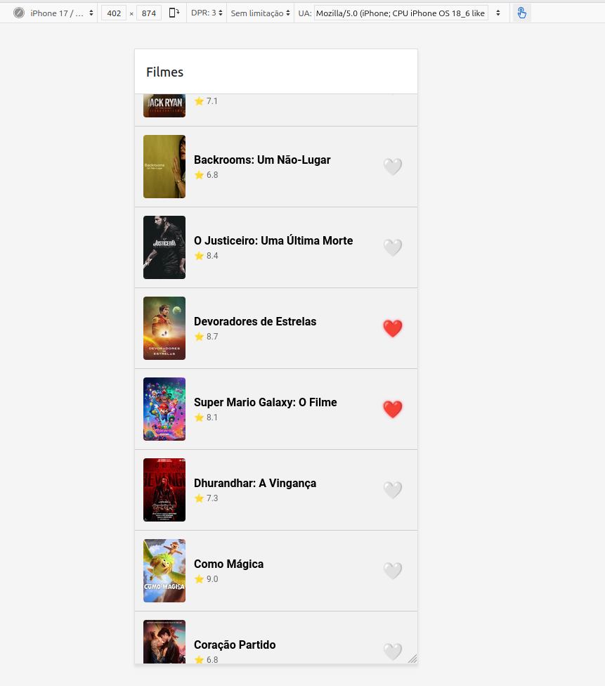
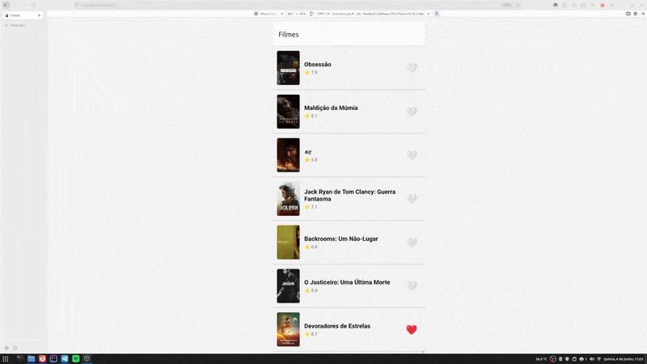

# README — Atividade 2 — André Gomes

## Identificação

- **Aluno:** André Gomes
- **Opção Reanimated escolhida:** A heart pop
- **Repo (seu fork):** [URL](https://github.com/bochiin/puc-iec-mobile-multiplataforma)

## Como rodar

```bash
npm install
npx expo start
```

> ⚠️ MMKV não roda em web. Use simulador iOS (`i`) ou Android (`a`).

## O que o app faz

O App tem como objetivo listar os filmes mais populares e do TMDB, visualizar suas descrições e favoritar os mesmos.

## Screenshot



## Screencast da animação



## Arquitetura

```
src/
├── navigation/
│   └── RootStack.tsx
├── screens/
│   ├── MovieList.tsx
│   └── MovieDetail.tsx
├── components/
│   ├── MovieCard.tsx
│   └── HeartButton.tsx       ← animação Reanimated
├── store/
│   ├── counterStore.ts
│   └── favoritesStore.ts     ← Zustand + persist + MMKV
├── api/
│   └── useMovies.ts          ← TanStack Query
└── storage/
    └── mmkv.ts
```

## Decisões técnicas (3-5 linhas)

- Escolhido a opção A pela menor complexidade de implementação e por avaliar que as outras opções não ia casar bem com o padrão do App
- Inclui a biblioteca de tipos do Jest para evitar erros de compilação no teste e facilitar auto-completes

## Referência

[1 referência — Reanimated docs, MMKV docs, Zustand docs, TanStack Query docs, ou material aula 2]

---

## 🎁 Bonus implementado (opcional)

- [ ] **Bottom Tabs com aba Favoritos filtrada — +2pt**
- [ ] Deep link `expo://detail/<id>` — +1pt
- [ ] 2 das 3 opções Reanimated (A/B/C) — +1pt
- [ ] TanStack Query `staleTime` + `prefetchQuery` — +1pt
- [ ] Hermes habilitado (verificar `app.json`) — +0.5pt
- [x] CI GitHub Actions verde — +0.5pt

[Liste o que implementou e cole código relevante OU print de execução]
