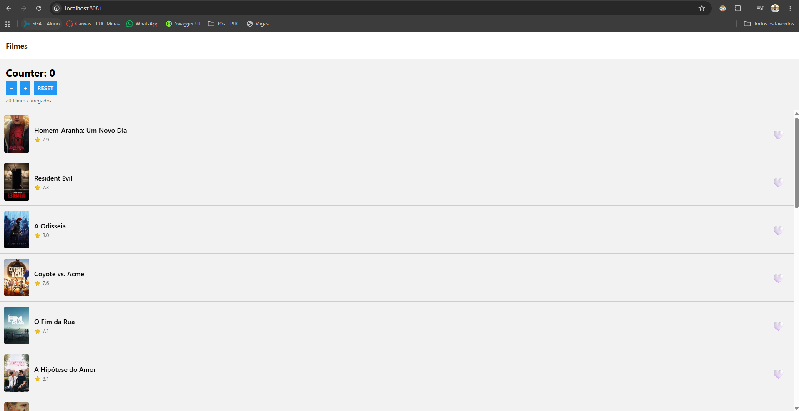
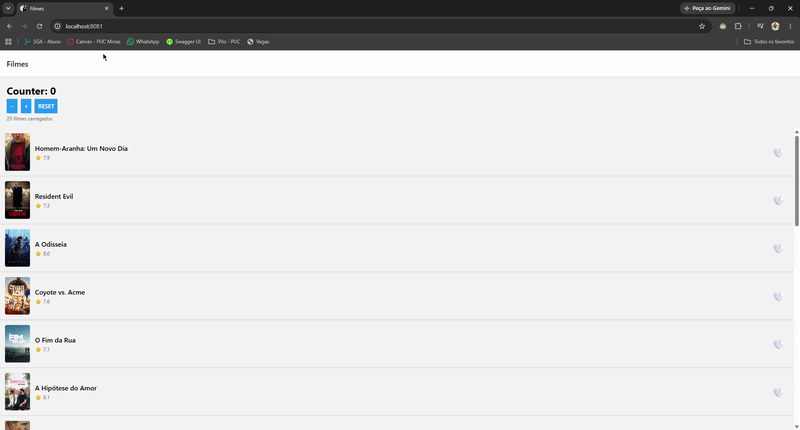

# README — Atividade 2 — Pedro Correa

## Identificação

- **Aluno:** Pedro Correa
- **Opção Reanimated escolhida:** A — Heart pop
- **Bonus implementado:** nenhum
- **Repo (seu fork):** https://github.com/PedroAC18/puc-iec-mobile-multiplataforma

## Como rodar

```bash
npm install
cp .env.example .env   # colar o TMDB API Read Access Token em EXPO_PUBLIC_TMDB_TOKEN
npx expo start
```

Testes:

```bash
npm test
```

> ⚠️ MMKV não roda em web nem no Expo Go (é módulo nativo). Use um development build em simulador iOS ou emulador Android.

## O que o app faz

Lista os filmes populares da TMDB (TanStack Query com `staleTime` de 5 min) e permite favoritar cada filme com o botão ❤️, tanto na lista quanto na tela de detalhe. Os favoritos ficam num store Zustand e são gravados no MMKV a cada mudança, então sobrevivem ao reload do app. O ❤️ é animado com Reanimated: ao tocar, escala 1 → 1.4 → 1 e gira levemente, tudo na UI thread.

## Screenshot



## Screencast da animação



## Arquitetura

```
src/
├── services/
│   └── api.ts                 ← axios + interceptors (TMDB)
├── queries/movies/            ← TanStack Query (server state)
│   ├── get-popular-movies.ts
│   ├── get-movie-by-id.ts
│   └── search-movies.ts
├── store/
│   ├── counterStore.ts        ← Zustand (counter do hands-on)
│   └── favoritesStore.ts      ← Zustand + persistência MMKV
├── storage/
│   └── mmkv.ts                ← instância MMKV + adapter getItem/setItem/removeItem
├── routes/
│   └── RootStack.tsx
├── screens/
│   ├── MovieList.tsx
│   └── MovieDetail.tsx
└── components/
    ├── MovieCard.tsx
    └── HeartButton.tsx        ← animação Reanimated (opção A)

__tests__/
├── counterStore.test.ts       ← 6 testes
└── favoritesStore.test.ts     ← 7 testes
```

## Decisões técnicas

- **Reanimated A (heart pop):** é a opção que melhor cabe num botão que aparece em todo card. `useSharedValue` guarda escala e rotação, `useAnimatedStyle` deriva o estilo, e `withSequence(withTiming(1.4), withSpring(1))` roda na UI thread sem passar pela bridge do JS. Não usei a `Animated` API legada.
- **MMKV em vez de AsyncStorage:** a leitura é síncrona (JSI), então o store já nasce com os favoritos carregados (`loadInitial`), sem estado de "carregando" nem flash de coração vazio.
- **Persistência via `subscribe` em vez do middleware `persist`:** o `subscribe` do `favoritesStore` grava o array de ids no MMKV sempre que `ids` muda. Fica explícito quando o save acontece e evita o problema do devtools do Zustand com `import.meta.env` no Metro web.
- **`HeartButton` como componente único:** `MovieCard` e `MovieDetail` usam o mesmo botão, então a animação e o acesso ao store ficam consistentes nas duas telas.

## Referência

- Reanimated — [docs.swmansion.com/react-native-reanimated](https://docs.swmansion.com/react-native-reanimated/)

---

## 🎁 Bonus implementado (opcional)

- [ ] Bottom Tabs com aba Favoritos filtrada — +2pt
- [ ] Deep link `expo://detail/<id>` — +1pt
- [ ] 2 das 3 opções Reanimated (A/B/C) — +1pt
- [ ] TanStack Query `staleTime` + `prefetchQuery` — +1pt
- [ ] Hermes habilitado (verificar `app.json`) — +0.5pt
- [ ] CI GitHub Actions verde — +0.5pt
