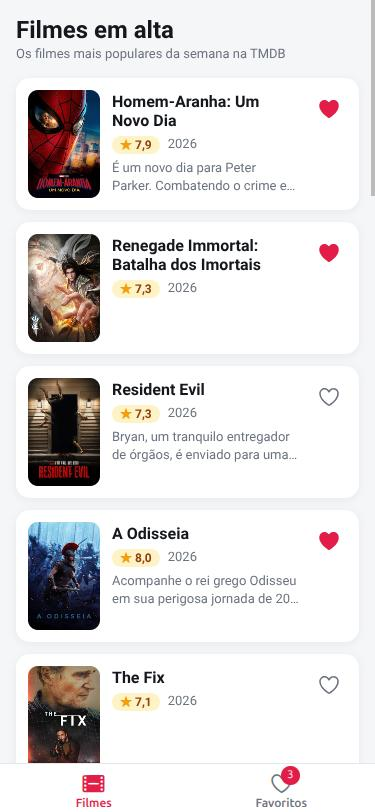
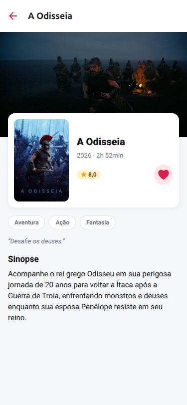

# Atividade 2: App de Feed com Favoritos, MMKV e Reanimated

## Identificação

- **Aluno:** Sesaque Cruz
- **Opção Reanimated escolhida:** A (heart pop)
- **Bônus implementado:** Bottom Tabs com aba Favoritos mostrando a lista persistida e paginação infinita na lista de filmes
- **Repo (fork):** https://github.com/sesaquecruz/puc-iec-mobile-multiplataforma

## Como rodar

```bash
npm install
cp .env.example .env   # cole a API key ou o token da TMDB em EXPO_PUBLIC_TMDB_TOKEN
npx expo start
```

O MMKV depende de módulo nativo, que não existe no Expo Go. Nele o app roda normalmente, mas os favoritos ficam só em memória. Para ver a persistência entre reloads no Android ou iOS, gere um development build:

```bash
npx expo run:android   # ou npx expo run:ios (macOS)
```

No navegador (`npx expo start --web`), o próprio `react-native-mmkv` usa `localStorage`, então a persistência também funciona.

Testes:

```bash
npm test
```

## O que o app faz

Lista os filmes populares da TMDB com TanStack Query, carregando a próxima página automaticamente ao chegar no fim da lista, e permite favoritar cada filme pelo coração, tanto na lista quanto na tela de detalhe. Os favoritos ficam num store Zustand, são salvos no MMKV a cada mudança e recarregados quando o app abre. O toque no coração dispara uma animação de escala e rotação feita com Reanimated, executada na UI thread. A aba Favoritos mostra os filmes salvos (os mais recentes primeiro), com contador no ícone e botão para limpar a lista com confirmação.

## Screenshots

| Lista | Detalhe | Favoritos |
|---|---|---|
|  |  |  |

Capturas da versão web em viewport de celular (375 x 812).

## Arquitetura

```
src/
├── routes/
│   ├── RootStack.tsx          ← Stack: Tabs + Detail
│   └── HomeTabs.tsx           ← Bottom Tabs: Filmes | Favoritos (bônus)
├── screens/
│   ├── MovieList.tsx
│   ├── MovieDetail.tsx
│   └── Favorites.tsx          ← lista persistida (bônus)
├── components/
│   ├── MovieCard.tsx
│   ├── HeartButton.tsx        ← animação Reanimated (opção A)
│   ├── RatingBadge.tsx
│   └── StateView.tsx          ← carregando, erro e vazio
├── store/
│   ├── counterStore.ts
│   └── favoritesStore.ts      ← Zustand + persistência via subscribe
├── storage/
│   └── mmkv.ts                ← MMKV com fallback em memória
├── queries/movies/            ← TanStack Query
├── services/api.ts            ← axios + TMDB
├── theme/                     ← tokens de cor, espaçamento e tipografia
└── utils/                     ← URLs de imagem e formatação
__tests__/                     ← 17 testes Jest (counter, favoritos, persistência, paginação e formatação)
```

## Decisões técnicas

- **Stack:** React Native com Expo, coerente com o ADR-0001 que entreguei na Atividade 1, que escolheu essa stack por aproveitar o conhecimento de React e TypeScript do time.
- **Opção A (heart pop):** é o gesto mais frequente do app, então o retorno visual imediato tem mais valor que um swipe ou uma transição. A animação usa só `useSharedValue`, `useAnimatedStyle`, `withSequence`, `withTiming` e `withSpring`, sem dependência extra de gestos.
- **MMKV em vez de AsyncStorage:** o MMKV é síncrono (JSI, sem bridge), então o store já nasce com os favoritos salvos. Não existe estado de carregamento nem os corações aparecendo vazios por um instante, como aconteceria com a leitura assíncrona do AsyncStorage.
- **Persistência via `subscribe`:** segue a orientação do starter, porque o middleware do Zustand usa `import.meta.env`, que quebra no bundler web do Metro. O save só acontece quando a lista de ids muda.
- **Reanimated 4.1 + react-native-worklets:** o starter trazia o Reanimated 3.16, mas o Expo SDK 54 (e o Expo Go 54) usa o 4.1. Alinhei as versões com `npx expo install --fix` para evitar erro de incompatibilidade entre a parte JS e a nativa.
- **Favoritos guardam só ids:** a aba Favoritos busca os dados de cada filme pelo mesmo `queryKey` da tela de detalhe, então reaproveita o cache do TanStack Query em vez de duplicar dados do servidor no store.
- **Design:** cores, espaçamentos e tipografia vêm de tokens em `src/theme`, e os ícones são do `@expo/vector-icons` para renderizar igual em Android, iOS e web. Toda tela trata carregamento, erro (com "Tentar novamente") e vazio pelo mesmo componente. No card, o coração e a área que abre o detalhe são botões separados, o que evita botão aninhado no web e dá dois alvos claros ao leitor de tela.
- **Paginação infinita:** `useInfiniteQuery` com `onEndReached` na `FlatList`. A próxima página respeita `total_pages` e o limite de 500 páginas da TMDB, e filmes repetidos entre páginas (a ordem de popularidade muda entre requisições) são removidos para não duplicar itens. Se uma página falhar, a lista já carregada continua na tela e o rodapé oferece "Tentar novamente".
- **Contador do hands-on:** o `counterStore` e seus testes continuam no projeto (TASKs 1 e 4), mas saiu da tela de filmes porque não faz parte do produto.

## Referências

- Reanimated: https://docs.swmansion.com/react-native-reanimated/
- react-native-mmkv: https://github.com/mrousavy/react-native-mmkv
- Zustand: https://github.com/pmndrs/zustand
- React Navigation, Bottom Tabs: https://reactnavigation.org/docs/bottom-tab-navigator

## Bônus

- [x] **Bottom Tabs com aba Favoritos** (`src/routes/HomeTabs.tsx` e `src/screens/Favorites.tsx`)
- [x] **Paginação infinita** (`src/queries/movies/get-popular-movies.ts` e `src/screens/MovieList.tsx`)
- [x] Hermes habilitado (padrão do Expo SDK 54; o bundle exportado sai em bytecode `.hbc`)
