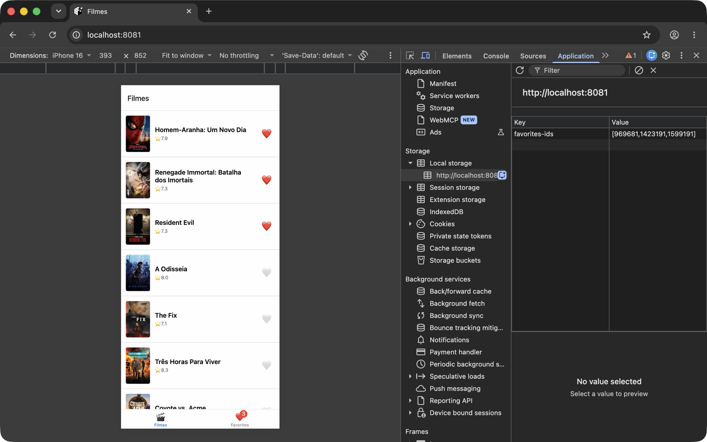
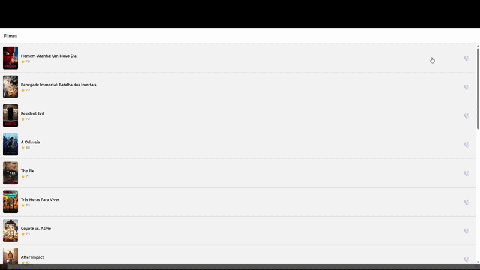

# Entrega — Atividade 2 — Paulo Aranha

## Identificação

- **Aluno:** Paulo Aranha
- **Opção Reanimated escolhida:** A — Heart pop **+** B — Card swipe
- **Bonus implementado:** Bottom Tabs com aba Favoritos · 2 opções Reanimated (A + B) · TanStack Query `staleTime` + `prefetchQuery` · Paginação infinita
- **Repo (seu fork):** <https://github.com/aranha/iec-mobile-multiplataforma>

## Como rodar

```bash
npm install
cp .env.example .env   # colar o token TMDB
npx expo start --web
npm test               # 14 testes Jest
```

> Desenvolvido e validado na **web**: o storage usa polyfill `localStorage` na web e MMKV (`new MMKV({ id: 'favorites-store' })`) no iOS/Android.

## O que o app faz

Lista os filmes populares da TMDB (TanStack Query, com paginação infinita ao chegar no fim da lista) em abas **Filmes** / **Favoritos**. O ❤️ (ou arrastar o card →) favorita o filme; arrastar ← descarta o card na sessão. Os favoritos ficam num store Zustand persistido no MMKV e sobrevivem a reloads; a aba Favoritos busca os detalhes por id reaproveitando o cache do TanStack Query.

## Screenshot



> Chrome em Device Mode (iPhone 16) com DevTools → Application → Local Storage: a chave `favorites-ids` guarda os ids persistidos.

## Screencast da animação



> Sequência (com DevTools → Local Storage atualizando ao vivo): heart pop em Homem-Aranha e Resident Evil → swipe → favorita Renegade Immortal → swipe ← descarta A Odisseia → aba Favoritos com os 3 → **reload da página**: favoritos continuam (persistência), e o card descartado volta (descarte é só da sessão).

## Arquitetura

```
src/
├── routes/
│   ├── RootStack.tsx          ← Stack: Home (abas) + Detail
│   └── HomeTabs.tsx           ← Bottom Tabs: Filmes / Favoritos (bônus)
├── screens/
│   ├── MovieList.tsx          ← FlatList + swipe + paginação infinita (bônus)
│   ├── MovieDetail.tsx        ← HeartButton no detalhe
│   └── FavoritesList.tsx      ← useQueries por id (bônus)
├── components/
│   ├── MovieCard.tsx          ← favorito + prefetch no onPressIn
│   ├── HeartButton.tsx        ← Reanimated opção A (heart pop)
│   └── SwipeableCard.tsx      ← Reanimated opção B (Gesture.Pan + runOnJS)
├── store/
│   ├── counterStore.ts
│   └── favoritesStore.ts      ← Zustand + persist manual (loadInitial + subscribe)
├── storage/
│   └── mmkv.ts                ← MMKV nativo / localStorage na web
├── queries/movies/            ← TanStack Query (popular com useInfiniteQuery, detalhe, busca)
└── services/api.ts            ← axios + interceptors
```

## Decisões técnicas (3-5 linhas)

- **Reanimated A + B:** o heart pop (A) dá feedback imediato ao toque; o swipe (B) exercita o caso mais exigente — animação acompanhando o dedo frame a frame. Nos dois, os valores ficam em `useSharedValue` e o estilo é calculado em worklet (`useAnimatedStyle`), então a animação roda na UI thread e não trava se a JS thread estiver ocupada. No swipe usei `Gesture.Pan()` (gesture-handler v2) porque `useAnimatedGestureHandler` está deprecado no Reanimated 3; os callbacks do gesto são worklets e chamam o store via `runOnJS`.
- **MMKV em vez de AsyncStorage:** MMKV é síncrono e acessado via JSI (sem bridge), então os favoritos são lidos já na criação do store (`loadInitial()`), sem estado intermediário de "hidratando" nem flash de corações vazios. Na web, que não tem MMKV nativo, o adapter `mmkvStorage` cai para `localStorage` com a mesma interface.
- **Persist manual (`subscribe`) em vez do middleware `persist`:** deixa explícito quando o save acontece, evita a hidratação assíncrona do middleware e o problema do Metro web citado no starter. O save só ocorre quando `ids` muda, e dado corrompido no storage não derruba o app (começa vazio).
- **Store guarda só `ids`:** fonte única da verdade para os dados do filme é o TanStack Query. A aba Favoritos usa `useQueries` com as mesmas `queryOptions` do detalhe (`['movie', id]`), então reaproveita o cache — inclusive o `prefetchQuery` disparado no `onPressIn` do card, que adianta a busca antes da navegação. Trade-off: a aba Favoritos depende de rede/cache para mostrar título e pôster.
- **Descartar (swipe ←) não persiste:** é estado local da `MovieList`, só da sessão — descartar é "não quero ver agora", diferente de favoritar, que é preferência do usuário.

## Referência

- [Reanimated docs](https://docs.swmansion.com/react-native-reanimated/) · [react-native-mmkv](https://github.com/mrousavy/react-native-mmkv) · [Zustand](https://github.com/pmndrs/zustand) · [TanStack Query](https://tanstack.com/query/latest)

## 🎁 Bonus implementado

- [x] **Bottom Tabs com aba Favoritos filtrada** — `src/routes/HomeTabs.tsx`, `src/screens/FavoritesList.tsx`
- [ ] Deep link `expo://detail/<id>`
- [x] 2 das 3 opções Reanimated (A/B/C) — `HeartButton.tsx` (A) + `SwipeableCard.tsx` (B)
- [x] TanStack Query `staleTime` + `prefetchQuery` — `movieByIdQueryOptions` + prefetch no `MovieCard`
- [x] Paginação infinita (TASK 10) — `useInfiniteQuery` em `get-popular-movies.ts` + `onEndReached` na `MovieList`

---

# Documentação original do starter

# Starter — Aula 2 (Arquitetura Mobile + Atividade 2)

App Expo + TypeScript com arquitetura profissional separando **services**, **queries**, **contexts**, **screens**, **components**.

> Você vai usar esse starter no **hands-on da Aula 2** (em sala) e na **Atividade 2** (entrega ver Canvas, 15pts).

---

## Arquitetura

```
src/
├── services/           ← HTTP (axios + interceptors)
│   └── api.ts
├── queries/            ← TanStack Query (server state)
│   └── movies/
│       ├── get-popular-movies.ts
│       ├── get-movie-by-id.ts
│       └── search-movies.ts
├── contexts/           ← Estado global APP (theme, auth)
│   └── ThemeContext.tsx
├── store/              ← Zustand (client state local)
│   ├── counterStore.ts
│   └── favoritesStore.ts
├── storage/            ← MMKV persistência
│   └── mmkv.ts
├── routes/             ← Navegação
│   └── RootStack.tsx
├── screens/            ← UI pura
│   ├── MovieList.tsx
│   └── MovieDetail.tsx
├── components/         ← Reutilizáveis
│   └── MovieCard.tsx
├── types/              ← Tipos TS
│   └── movie.ts
└── utils/              ← Helpers
    └── poster-url.ts

__tests__/              ← Jest + RTL
├── counterStore.test.ts
└── favoritesStore.test.ts

.github/workflows/
└── test.yml            ← CI valida ≥ 6 testes verdes
```

**Regra arquitetural:**
- `services/` = "como falar com backend"
- `queries/` = "como gerenciar ciclo de vida dos dados (server state)"
- `contexts/` = "como compartilhar estado global da aplicação (client state)"
- `screens/` = "renderizar estados da UI"

> Screen **não** conhece axios, endpoint, cache, retry. Ela **só consome dados**.

---

## Setup

### 1. Clonar e instalar

```bash
git clone https://github.com/SEU-USUARIO/puc-iec-mobile-multiplataforma.git
cd puc-iec-mobile-multiplataforma/exercicios/02-app-rn-navegacao-estado/starter
npm install
```

### 2. Gerar TMDB API token

1. Cria conta em <https://www.themoviedb.org/signup>
2. Settings → **API** → Request API key (Developer, uso pessoal/educacional)
3. Copia o **API Read Access Token** (formato `eyJhbGc...` longo)
4. `cp .env.example .env` e cola o token:

```bash
EXPO_PUBLIC_TMDB_TOKEN=eyJhbGc...seu_token_aqui
```

> ⚠️ `.env` está no `.gitignore`. **Nunca comite tokens.**

### 3. Rodar

```bash
npx expo start         # menu interativo
# OU
npx expo start --ios   # simulador iOS
npx expo start --android  # emulador Android
```

> ⚠️ MMKV não roda em **web** (precisa JSI nativo). Use simulador iOS/Android pra Atividade 2.

### 4. Rodar testes

```bash
npm test
# ou em watch mode
npm run test:watch
# ou cobertura
npm run test:coverage
```

CI roda automático em todo push pro `main` do seu fork. Mínimo: **6 testes verdes**.

---

## Tasks guiadas

9 tasks sequenciais + 1 bônus opcional. Lista completa em [`PASSOS.md`](./PASSOS.md).

```bash
grep -rn "TODO \[TASK" src/ __tests__/
```

| Tag | Hands-on aula | Atividade 2 |
|---|---|---|
| TASK 1 | Zustand counter store | — |
| TASK 2 | TanStack Query | — |
| TASK 3 | FlatList + MovieCard | — |
| TASK 4 | Testes counter (IA) | — |
| TASK 5 | — | Zustand favorites |
| TASK 6 | — | Integrar favorites em MovieCard |
| TASK 7 | — | MMKV persist |
| TASK 8 | — | HeartButton Reanimated |
| TASK 9 | — | Testes favorites (IA) |
| TASK 10 🎁 | — | Paginação infinita (bônus, não vale ponto) |

Entrega: push pro fork → PR → CI valida automático. Sem README/screencast obrigatório.

---

## Endpoints TMDB usados

```bash
# Filmes populares
curl 'https://api.themoviedb.org/3/movie/popular?language=pt-BR&page=1' \
  -H "Authorization: Bearer $TOKEN"

# Detalhes
curl 'https://api.themoviedb.org/3/movie/603?language=pt-BR' \
  -H "Authorization: Bearer $TOKEN"

# Buscar
curl 'https://api.themoviedb.org/3/search/movie?language=pt-BR&query=matrix' \
  -H "Authorization: Bearer $TOKEN"
```

Service em `src/services/api.ts` encapsula essas chamadas. Queries em `src/queries/movies/` adicionam cache+ciclo de vida via TanStack Query.

---

## Dicas

- **Path alias:** import com `@/` → resolve pra `src/`. Ex: `import { api } from '@/services/api'`.
- **Reanimated:** plugin Babel já configurado (`babel.config.js`). Restart Metro se mudar config.
- **Hermes:** habilitado por padrão no Expo SDK 54+.

---

## Referências

- [Zustand](https://github.com/pmndrs/zustand)
- [TanStack Query](https://tanstack.com/query/latest)
- [React Navigation v7](https://reactnavigation.org/docs/getting-started)
- [React Native MMKV](https://github.com/mrousavy/react-native-mmkv)
- [Reanimated](https://docs.swmansion.com/react-native-reanimated/)
- [TMDB API docs](https://developer.themoviedb.org/reference/intro/getting-started)
