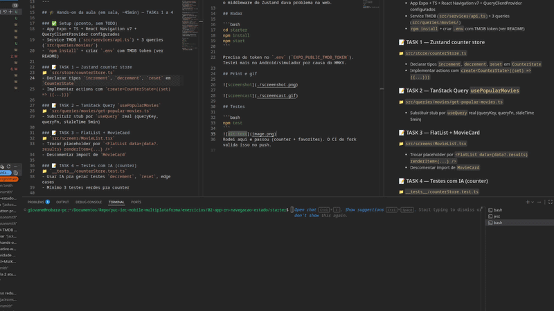
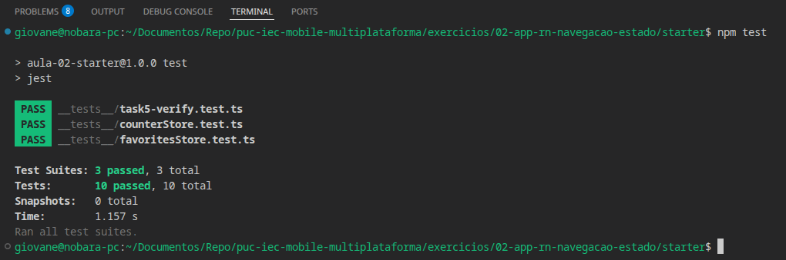

# Atividade 2 — Giovane Carvalho Reis

**Repo:** https://github.com/giovane-carvalho-reis/puc-iec-mobile-multiplataforma  
**Branch:** `entrega/atividade-2-giovane-carvalho-reis`

## Reanimated

Usei a opção **A (heart pop)** no `HeartButton.tsx`. Quando clica no coração ele dá um zoom rápido e volta. Está na lista (`MovieCard`) e no detalhe do filme.

## O app

Puxa filmes populares da TMDB, dá pra favoritar com o coração e os favoritos ficam salvos (MMKV no celular, localStorage na web). Fiz o persist do favorites com `subscribe` no store porque no starter já vinha assim e o middleware do Zustand dava problema na web.

## Rodar

```bash
cd starter
npm install
npm start
```

Precisa do token no `.env` (`EXPO_PUBLIC_TMDB_TOKEN`). Testei mais no Android/simulador por causa do MMKV.

## Print e gif



## Testes

```bash
npm test
```

Rodei aqui e passou (counter + favorites). O CI do fork valida isso no push.
