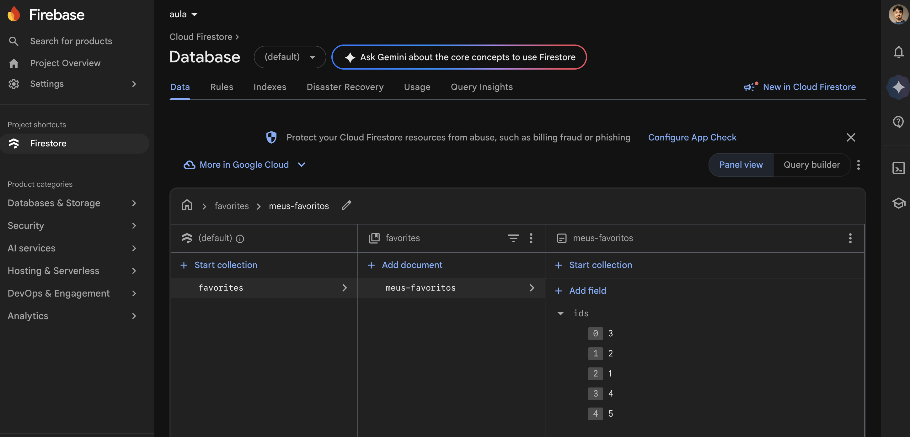
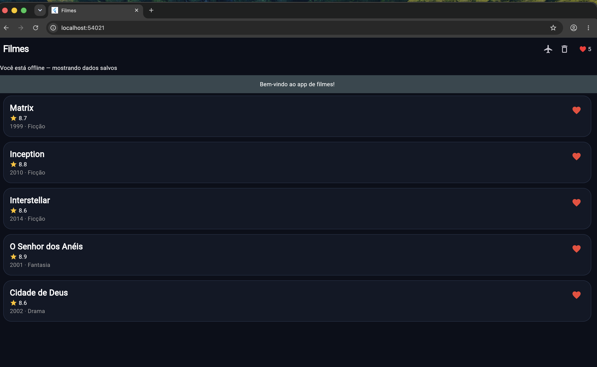

# Atividade 3 — App Flutter: UI + Estado + Firebase + Offline-first

Catálogo de filmes em **Flutter**: você compõe a UI (`MovieCard`), gerencia **estado compartilhado com Riverpod**, persiste na nuvem com **Firebase** (Firestore + Remote Config) e faz o app funcionar **sem internet** (cache, TTL e fila de sincronização). Começa em aula e termina neste projeto.

- 📄 **[enunciado.md](enunciado.md)** — objetivos, exercícios, tempo estimado e rubrica (15 pts)
- 🪜 **[guia-passo-a-passo.md](guia-passo-a-passo.md)** — as TASKs passo a passo (mesma numeração do enunciado)
- 📁 **[pratica/](pratica/)** — o projeto Flutter (já roda; complete os scaffolds)

## Persistência demonstrada

O app combina três camadas: o **estado local** do Riverpod atualiza a UI imediatamente; o **Firestore (cloud)** persiste os IDs dos favoritos; e o modo **offline-first** usa o cache local do Firestore e o repositório cache-first para continuar exibindo os dados sem internet. Para conferir a persistência cloud, favorite um filme, faça um refresh completo (`F5`) e confirme que o coração e o contador continuam ativos; o documento `favorites/meus-favoritos` também pode ser conferido no console do Firebase:



O modo offline pode ser conferido pelo botão de avião: o banner informa que os dados salvos estão sendo exibidos e a lista de filmes/favoritos continua disponível:



## Em 1 minuto
```bash
cd exercicios/03-flutter-ui-estado/pratica
ls lib                              # prova de que você está no lugar certo (dir lib no Windows)
flutter pub get
flutter run -d chrome --web-port 5300  # app abre — PORTA FIXA: o cache offline vive por porta
flutter test                        # começa VERMELHO — deixe tudo verde
flutter test test/offline_test.dart # só as TASKs de offline-first (11–15)
```

**Entrega:** fork + PR (prazo: **ver Canvas**). O J.A.R.V.I.S. comenta uma **nota mínima** estrutural no PR; **o `flutter test` é você quem roda**.

> Bridging nativo (Platform Channel / KMP) é a **Aula 4/5** — aqui o foco é **UI + estado + nuvem + offline**.
