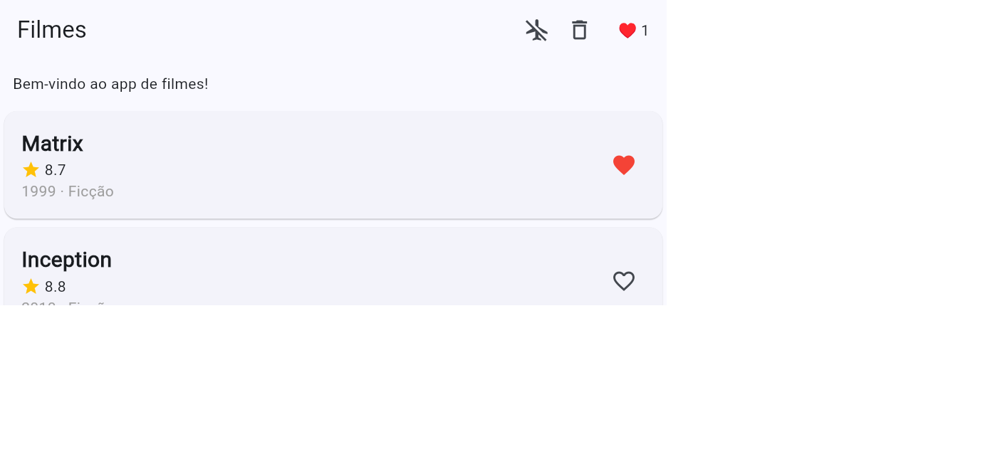

# Filmes (Flutter) — Atividade 3

Catálogo Flutter com Riverpod, Firebase (Firestore + Remote Config) e arquitetura offline-first.

## Rodar no Chrome
```bash
flutter pub get
flutter run -d chrome --web-port 5300
```

O app já abre sem credenciais Firebase; nesse caso favoritos ficam em memória e o banner usa o texto padrão. Para ativar cloud, configure um projeto Firebase próprio (plano Spark): instale `firebase-tools`, rode `firebase login` e `dart pub global activate flutterfire_cli`; depois `flutterfire configure` e selecione a plataforma Web. O comando substitui `lib/firebase_options.dart` por suas opções reais. No Console Firebase, crie Firestore em modo teste e Remote Config com o parâmetro string `banner_message` (publique a alteração). Conforme o enunciado, as opções de um projeto pessoal de aula podem ser incluídas no PR; não reutilize essa configuração em produção.

## Testes e análise
```bash
flutter test
flutter test test/offline_test.dart
flutter analyze
```

O botão de avião simula desconexão. Abra o app online pelo menos uma vez antes de testar o cache offline; mantenha a porta `5300` para reutilizar o armazenamento do navegador. O cache e a fila de sincronização usam SharedPreferences (localStorage na Web). Firestore guarda os favoritos no documento `favorites/meus-favoritos` e a persistência offline do SDK fica habilitada.

## Trade-offs: local, cloud e offline-first

O estado local responde rápido e continua disponível sem rede, mas por si só fica restrito ao dispositivo e pode desaparecer ao limpar os dados. O Firestore persiste favoritos e os sincroniza entre dispositivos, porém depende de configuração, conexão e pode introduzir latência ou conflitos. A abordagem offline-first combina os dois: o app exibe primeiro o cache local e aceita mudanças durante a desconexão; ao voltar a rede, tenta sincronizar a fila, mantendo as operações pendentes em caso de falha. Assim a interface continua utilizável, ao custo de implementar validade do cache e regras de reconciliação.

## Evidência: favorito persistido no Firestore

Após atualizar a página, Matrix continuou favoritado (contador `1`) e o banner veio do Remote Config:



## Entrega
Edite os arquivos nesta pasta, sem criar `aluno-.../`; faça fork + Pull Request e envie o link pelo Canvas. Inclua na entrega um print/GIF do favorito sobrevivendo ao refresh após configurar o Firebase (opcional: captura da tela offline). Não comite `.dart_tool/`, `build/` nem `pubspec.lock`.
