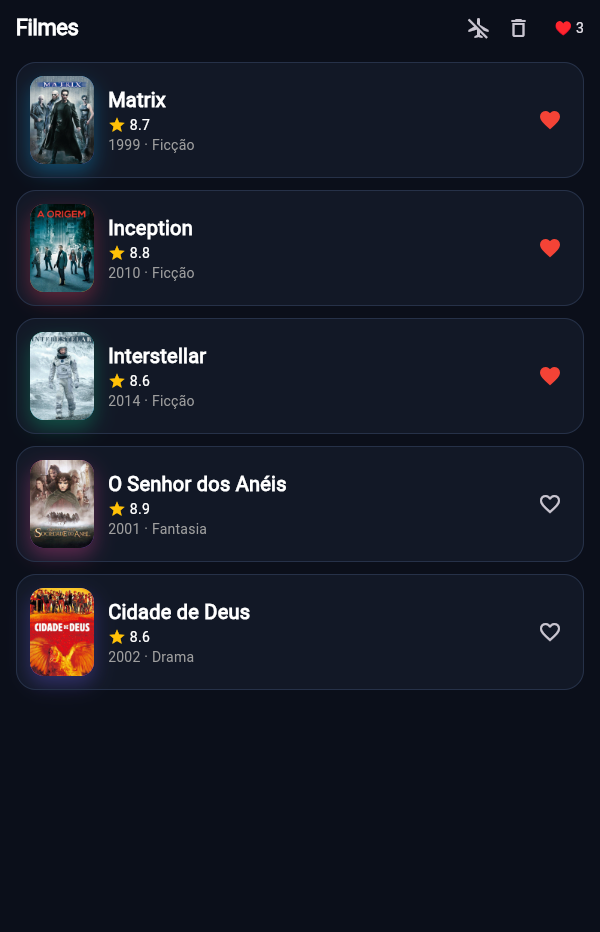
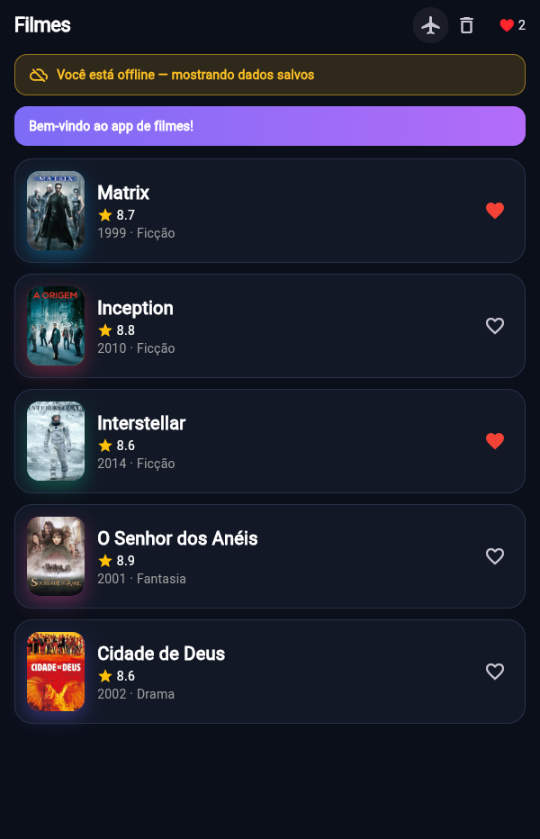
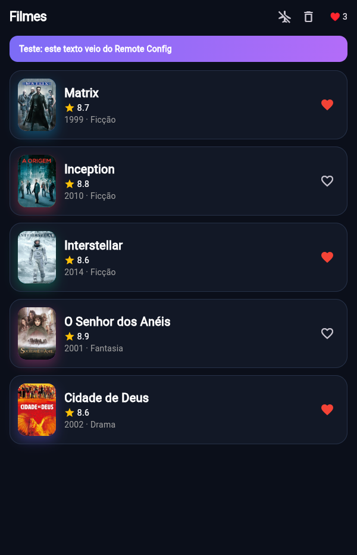

# Filmes (Flutter) — Atividade 3: UI + Estado + Firebase + Offline-first

**Autor:** Allainn Christiam Jacinto Tavares · **Data:** 05/10/2026
**Disciplina:** Arquitetura de Aplicações Móveis e Multiplataforma — PUC Minas IEC

Catálogo de filmes em Flutter: `MovieCard` composto, favoritos com **Riverpod** persistidos no **Firestore**, banner via **Remote Config** e lista **offline-first** (cache, TTL e fila de sincronização). As 15 TASKs estão completas.

## Como rodar

Requisitos: Flutter **3.27+** (testado com 3.47.6 / Dart 3.13.5) e um navegador.

```bash
cd exercicios/03-flutter-ui-estado/pratica
flutter pub get
flutter run -d chrome --web-port 5300      # ou ./rodar.sh · F5 no VS Code
```

- **Porta fixa 5300:** o cache da lista e a fila ficam no `localStorage`, que é separado por endereço + porta. Abra uma vez online antes de testar offline.
- **WSL (sem Chrome no Linux):** `flutter run -d web-server --web-port 5300` e abra http://localhost:5300 no navegador do Windows. Mudou o código? `r` (hot reload) ou `R` (hot restart) no terminal; F5 no navegador não recompila.
- **Firebase:** `lib/firebase_options.dart` aponta para o meu projeto `filmes-flutter-allainn` (plano Spark, só web): Firestore em `southamerica-east1` e o parâmetro `banner_message` publicado no Remote Config. Para usar outro projeto: `flutterfire configure --platforms=web`.
- **Dados reais do TMDB (opcional):** `.env.local` com `TMDB_KEY=<API Key v3>` e `./rodar.sh` (no WSL: acrescente `--dart-define-from-file=.env.local` ao comando do `web-server`). Sem a chave, o app usa a lista simulada (5 filmes).
- **Modo avião:** o ✈️ da barra simula a falta de rede (DevTools → Network → Offline também vale).

## Testes

```bash
flutter analyze    # No issues found!
flutter test       # 31/31 verdes
```

| Arquivo | Testes | O que cobre |
|---|---|---|
| `test/app_test.dart` (professor) | 3 | Ex1 card · Ex2 favoritar e limpar |
| `test/checklist_test.dart` (professor) | 4 | ponta a ponta do Ex1–Ex3 |
| `test/offline_test.dart` (professor) | 20 | TASKs 11–15 |
| `test/favorites_test.dart` (**meu**, TASK 9) | 2 | `toggle`/`clear` com `ProviderContainer` · cada ação cria um `Set` novo e notifica uma vez |
| `test/sync_queue_extra_test.dart` (**meu**) | 2 | fila gravada **no meio** do `flush` · favoritar → desfavoritar → favoritar offline |

O `sync_queue_extra_test.dart` existe porque o teste "flush persiste a cada sucesso" do `offline_test` também passa com um `flush` que só grava no fim (testado trocando o código de propósito). O teste extra lê o armazenamento durante o envio e pega esse erro.

## Evidências (Firestore, offline e Remote Config)

Favorito sobrevivendo ao recarregamento: favoritei o Inception (o documento `favorites/meus-favoritos` passou de `[1, 3]` para `[1, 3, 2]`) e dei F5.

| Favoritou | Depois do F5 |
|---|---|
|  |  |

| Offline (✈️ ligado) | Remote Config |
|---|---|
|  |  |

No print do Remote Config, publiquei um valor de teste para `banner_message` e o banner mudou sem recompilar; depois restaurei `Bem-vindo ao app de filmes!`.

## Local × cloud × offline-first

O estado **local** (o `favoritesProvider` da TASK 2, só em memória) é o mais simples e o mais rápido: responde na hora, funciona sem rede e se testa com um `ProviderContainer`, mas some no F5 e fica preso a um aparelho. O estado **cloud** (Firestore, TASK 7) resolve isso, porque o favorito sobrevive ao recarregamento e vale em qualquer aparelho ligado ao mesmo projeto, mas cobra em rede e latência: sem a atualização otimista (mudar o `state` antes de o `.set()` responder), cada toque no ♥ esperaria a ida e a volta ao servidor, e entram em jogo regras de acesso, custo e falhas parciais. O **offline-first** (TASKs 10–15) inverte a dependência: a fonte da verdade da tela passa a ser o aparelho, e a rede vira otimização. A lista sai do cache na hora, o TTL evita chamadas enquanto o dado é recente e as escritas feitas sem rede entram numa fila. O preço é complexidade e consistência eventual: a lista pode ficar até 10 minutos desatualizada, a fila precisa de regras de conflito (ação oposta cancela, ordem preservada, persistir a cada envio) e o Firestore resolve conflitos pela última escrita. Neste app a combinação faz sentido porque o catálogo é muito lido e tolera atraso, enquanto o favorito é um dado pequeno e pessoal que precisa sobreviver ao recarregamento.

## Decisões e limitações

- **Favoritos (TASK 7):** se o usuário mexer antes de a leitura inicial do Firestore responder, a leitura não sobrescreve o clique (`_changedLocally`). Os ids são lidos como `num` e convertidos com `toInt()`, porque na web um número pode chegar como `double`.
- **Remote Config (TASK 8):** busca uma vez, no `initState` de um widget próprio. No `build` da `HomeScreen`, cada toque no ♥ faria uma nova busca. `fetchBannerMessage()` nunca lança erro: sem rede ou sem Firebase devolve o último valor ativado ou o padrão. `minimumFetchInterval: Duration.zero` é didático (o padrão é 12 h).
- **Cache (TASKs 13 e 14):** só a `OfflineException` é tolerada quando há cache; outro erro (ex.: chave do TMDB inválida) continua aparecendo. Fresco é `idade < ttl`, estritamente.
- **Segurança:** a regra do Firestore libera leitura e escrita em um único documento, sem login, o que basta para a aula. Em produção seria preciso Firebase Auth e um documento por usuário (`favorites/{uid}`).
- **Abas:** os favoritos são lidos com `.get()`, uma vez. Outra aba só atualiza com F5; `.snapshots()` daria sincronização em tempo real.
- **`SyncQueue` (TASK 15):** não está ligada aos favoritos (bônus não feito). Para eles, a persistência offline do Firestore (TASK 10) já enfileira as escritas. A fila também não trata um `enqueue` concorrente com um `flush` em andamento.

## Referências

- FIREBASE. **Access data offline**. Firestore. Disponível em: https://firebase.google.com/docs/firestore/manage-data/enable-offline. Acesso em: 5 out. 2026.
- FIREBASE. **Get started with Firebase Remote Config**. Disponível em: https://firebase.google.com/docs/remote-config/get-started?platform=flutter. Acesso em: 5 out. 2026.
- FLUTTER. **Offline-first support**. Flutter Docs: App architecture. Disponível em: https://docs.flutter.dev/app-architecture/design-patterns/offline-first. Acesso em: 5 out. 2026.
- RIVERPOD. **Getting started**. Disponível em: https://riverpod.dev/docs/introduction/getting_started. Acesso em: 5 out. 2026.
- ARCHIBALD, Jake. **The offline cookbook**. 2014. Disponível em: https://jakearchibald.com/2014/offline-cookbook/. Acesso em: 5 out. 2026.
- KLEPPMANN, Martin. **Designing Data-Intensive Applications**. Sebastopol: O'Reilly Media, 2017. Cap. 5: Replication (clientes com operação offline e resolução de conflitos).
